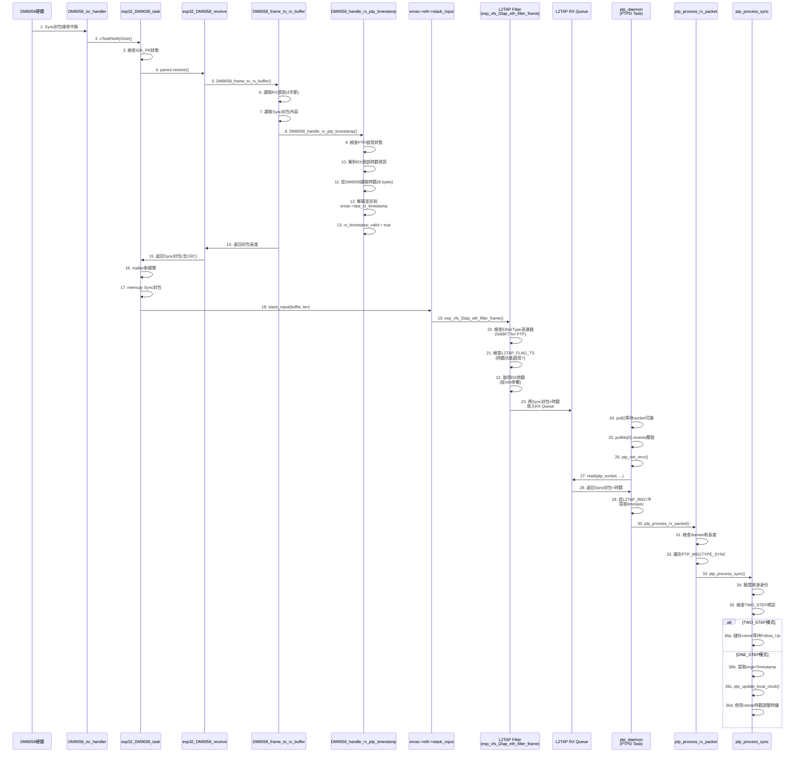

# Sync 封包從驅動程式到 PTPD 的完整處理流程

## 流程圖



---

## 階段 1: 硬體驅動層 (DM9058 MAC)

### 1.1 中斷觸發

**位置:** `components/esp_eth/src/spi/dm9058/esp_eth_mac_dm9058.c:882-890`

```c
IRAM_ATTR static void DM9058_isr_handler(void *arg) {
    esp32_DM9058_t *emac = (esp32_DM9058_t *)arg;
    BaseType_t high_task_wakeup = pdFALSE;
    /* notify DM9058 task */
    vTaskNotifyGiveFromISR(emac->rx_task_hdl, &high_task_wakeup);
    if (high_task_wakeup != pdFALSE) {
        portYIELD_FROM_ISR();
    }
}
```

**功能:**
- 硬體接收到 Sync 封包後觸發 ISR_PR 中斷
- 喚醒 RX 任務處理封包

---

### 1.2 RX任務處理

**位置:** `components/esp_eth/src/spi/dm9058/esp_eth_mac_dm9058.c:1121-1155`

```c
static void esp32_DM9058_task(void *arg)
{
    esp32_DM9058_t *emac = (esp32_DM9058_t *)arg;
    uint8_t status = 0;

    while (1) {
        // 等待中斷通知
        if (emac->int_gpio_num >= 0) {
            if (ulTaskNotifyTake(pdTRUE, pdMS_TO_TICKS(1000)) == 0 &&
                    gpio_get_level(emac->int_gpio_num) == 0) {
                continue;
            }
        } else {
            ulTaskNotifyTake(pdTRUE, portMAX_DELAY);
        }

        /* 清除中斷狀態 */
        DM9058_register_read(emac, DM9058_ISR, &status);
        DM9058_register_write(emac, DM9058_ISR, status);

        /* packet received */
        if (status & ISR_PR) {
            do {
                uint32_t buf_len;
                if (emac->parent.receive(&emac->parent, emac->rx_buffer, &buf_len) == ESP_OK) {
                    if (buf_len > 0) {
                        uint8_t *buffer = malloc(buf_len);
                        if (buffer == NULL) {
                            ESP_LOGE(TAG, "no mem for receive buffer");
                        } else {
                            memcpy(buffer, emac->rx_buffer, buf_len);
                            ESP_LOGD(TAG, "receive len=%" PRIu32, buf_len);
                            /* ★ 關鍵: 傳給網路棧 ★ */
                            emac->eth->stack_input(emac->eth, buffer, buf_len);
                        }
                    }
                }
            } while (emac->packets_remain);
        }
    }
}
```

**關鍵步驟:**
1. 檢查 `ISR_PR` (Packet Received) 狀態
2. 調用 `parent.receive()` 讀取封包
3. 分配新緩衝並複製數據
4. 調用 `stack_input()` 傳送給上層

---

### 1.3 PTP時戳提取

**位置:** `components/esp_eth/src/spi/dm9058/esp_eth_mac_dm9058.c:952-995`

```c
static esp_err_t DM9058_handle_rx_ptp_timestamp(esp32_DM9058_t *emac,
                                               const DM9058_rx_header_t *header)
{
    // 1. 檢查 PTP 是否啟用
    if (!emac->ptp_auto_process || !emac->ptp.enabled) {
        emac->rx_timestamp_valid = false;
        return ESP_OK;
    }

    // 2. 解析 RX 頭部
    uint8_t rx_header_bytes[DM9058_RX_HDR_SIZE] = {
        header->flag,
        header->status,
        header->length_low,
        header->length_high,
    };
    esp_eth_ptp_dm9058_rx_info_t rx_info = {0};
    esp_err_t parse_ret = esp_eth_ptp_dm9058_parse_rx_header(
        rx_header_bytes, sizeof(rx_header_bytes), ETH_MAX_PACKET_SIZE, &rx_info);

    // 3. 確定時戳長度 (4 或 8 字節)
    size_t timestamp_len = 0;
    if (parse_ret == ESP_OK) {
        timestamp_len = rx_info.timestamp_available ? rx_info.timestamp_len : 0;
    } else if (header->status & DM9058_RSR_RXTS_EN) {
        timestamp_len = (header->status & DM9058_RSR_RXTS_LEN) ? 8 : 4;
    }

    if (timestamp_len == 0) {
        emac->rx_timestamp_valid = false;
        return ESP_OK;
    }

    // 4. 從 DM9058 內存讀取時戳數據
    uint8_t ts_buffer[8] = {0};
    ESP_RETURN_ON_FALSE(timestamp_len <= sizeof(ts_buffer), ESP_ERR_INVALID_SIZE,
                       TAG, "timestamp too long");
    ESP_RETURN_ON_ERROR(DM9058_memory_read(emac, ts_buffer, timestamp_len),
                       TAG, "read rx timestamp failed");

    // 5. 解碼時戳並儲存
    if (parse_ret == ESP_OK) {
        esp_err_t decode_ret = esp_eth_ptp_dm9058_rx_timestamp(
            ts_buffer, timestamp_len, &emac->last_rx_timestamp);

        if (decode_ret == ESP_OK) {
            emac->rx_timestamp_valid = true;
            ESP_LOGD(TAG, "RX PTP timestamp: %lu.%09lu",
                     emac->last_rx_timestamp.seconds,
                     emac->last_rx_timestamp.nanoseconds);
        } else {
            emac->rx_timestamp_valid = false;
            ESP_LOGW(TAG, "decode rx timestamp failed: %s", esp_err_to_name(decode_ret));
        }
    }

    return ESP_OK;
}
```

**調用位置:**
在 `DM9058_frame_to_rx_buffer()` 內調用：
```c
ESP_GOTO_ON_ERROR(DM9058_handle_rx_ptp_timestamp(emac, &header),
                  err, TAG, "handle rx ptp timestamp failed");
```

**功能:**
1. 解析 RX 頭部判斷是否有時戳
2. 讀取時戳數據 (4或8字節)
3. 解碼並存儲到 `emac->last_rx_timestamp`
4. 設置 `emac->rx_timestamp_valid = true`

---

## 階段 2: L2TAP 過濾層 (VFS)

### 2.1 L2TAP過濾

**位置:** `components/esp_netif/vfs_l2tap/esp_vfs_l2tap.c:220-290`

```c
esp_err_t esp_vfs_l2tap_eth_filter_frame(l2tap_iodriver_handle driver_handle,
                                          void *buff, size_t *size, void *info)
{
    struct eth_hdr *eth_header = buff;
    uint16_t eth_type = ntohs(eth_header->type);

    for (int i = 0; i < L2TAP_MAX_FDS; i++) {
        if (atomic_load(&s_l2tap_sockets[i].state) == L2TAP_SOCK_STATE_OPENED) {
            l2tap_enter_critical();

            // ★ 檢查 EtherType 過濾器 ★
            if (s_l2tap_sockets[i].driver_handle == driver_handle &&
                (s_l2tap_sockets[i].ethtype_filter == eth_type ||
                 (s_l2tap_sockets[i].ethtype_filter <= ETH_IEEE802_3_MAX_LEN &&
                  eth_type <= ETH_IEEE802_3_MAX_LEN))) {

                l2tap_exit_critical();

                eth_mac_time_t *ts;
                // ★ 檢查是否啟用時戳功能 ★
                if (s_l2tap_sockets[i].flags & L2TAP_FLAG_TS) {
                    ts = (eth_mac_time_t *)info;  // 從info取得時戳!
                } else {
                    ts = NULL;
                }

                // 將封包+時戳放入 RX Queue
                l2tap_enqueue_frame(&s_l2tap_sockets[i], buff, *size, ts);

                // 通知有數據可讀
                if (s_l2tap_sockets[i].select_sem) {
                    xSemaphoreGive(s_l2tap_sockets[i].select_sem);
                }
            } else {
                l2tap_exit_critical();
            }
        }
    }
    return ESP_OK;
}
```

**關鍵點:**
- `info` 參數包含從 DM9058 驅動提取的時戳資訊 (`eth_mac_time_t *`)
- 檢查 EtherType 是否為 PTP (0x88F7)
- 檢查是否啟用時戳功能 (`L2TAP_FLAG_TS`)
- 將封包和時戳一起入隊

---

### 2.2 入隊操作

```c
static void l2tap_enqueue_frame(l2tap_socket_t *socket,
                                void *buff, size_t size,
                                eth_mac_time_t *ts)
{
    l2tap_rx_ebuff_t *new_item = calloc(1, sizeof(l2tap_rx_ebuff_t));
    if (new_item == NULL) {
        return;
    }

    new_item->size = size;
    new_item->buff = malloc(size);
    if (new_item->buff == NULL) {
        free(new_item);
        return;
    }

    memcpy(new_item->buff, buff, size);

    // ★ 儲存時戳到佇列 ★
    if (ts) {
        new_item->ts.seconds = ts->seconds;
        new_item->ts.nanoseconds = ts->nanoseconds;
    }

    // 加入佇列
    if (xQueueSendToBack(socket->rx_queue, &new_item, 0) != pdTRUE) {
        free(new_item->buff);
        free(new_item);
    }
}
```

---

## 階段 3: PTPD Socket讀取

### 3.1 PTPD初始化

**位置:** `examples/ethernet/ptp/components/ptpd/ptpd.c:606-665`

```c
static int ptp_initialize_state(struct ptp_state_s *state, const char *interface)
{
    // 1. 開啟 L2TAP socket
    state->ptp_socket = open("/dev/net/tap", 0);
    if (state->ptp_socket < 0) {
        ptperr("Failed to create tx socket: %d\n", errno);
        return ERROR;
    }

    // 2. 綁定網路介面
    if (ioctl(state->ptp_socket, L2TAP_S_INTF_DEVICE, interface) < 0) {
        ptperr("failed to set network interface at socket: %d\n", errno);
        return ERROR;
    }

    // 3. 設置 EtherType 過濾器為 PTP (0x88F7)
    uint16_t eth_type_filter = ETH_TYPE_PTP;
    if (ioctl(state->ptp_socket, L2TAP_S_RCV_FILTER, &eth_type_filter) < 0) {
        ptperr("failed to set Ethertype filter: %d\n", errno);
        return ERROR;
    }

    // 4. 取得 Ethernet handle
    esp_eth_handle_t eth_handle;
    if (ioctl(state->ptp_socket, L2TAP_G_DEVICE_DRV_HNDL, &eth_handle) < 0) {
        ptperr("failed to get socket eth_handle %d\n", errno);
        return ERROR;
    }

    // 5. 啟用驅動層的 PTP 時戳功能
    bool enable = true;
    esp_eth_ioctl(eth_handle, ETH_MAC_DM9058_CMD_PTP_ENABLE, &enable);

    // 6. 初始化 PTP 時鐘
    esp_eth_clock_cfg_t clk_cfg = {
        .eth_hndl = eth_handle,
    };
    esp_eth_clock_init(CLOCK_PTP_SYSTEM, &clk_cfg);

    // 7. ★ 啟用 L2TAP 時戳功能 ★
    if (ioctl(state->ptp_socket, L2TAP_S_TIMESTAMP_EN) < 0) {
        ptperr("failed to enable time stamping in l2 socket: %d\n", errno);
        return ERROR;
    }

    return OK;
}
```

**配置總結:**
1. 開啟 `/dev/net/tap` socket
2. 綁定到指定網路介面 (如 "eth0")
3. 設置 EtherType 過濾為 0x88F7 (PTP)
4. 啟用驅動層 PTP 功能
5. 啟用 L2TAP 時戳功能

---

### 3.2 主循環等待

**位置:** `examples/ethernet/ptp/components/ptpd/ptpd.c:1843-1975`

```c
static void ptp_daemon(void *task_param)
{
    struct ptp_state_s *state;
    struct pollfd pollfds[1];
    int ret;

    state = calloc(1, sizeof(struct ptp_state_s));

    if (ptp_initialize_state(state, interface) != OK) {
        ptperr("Failed to initialize PTP state, exiting\n");
        goto err;
    }

    pollfds[0].events = POLLIN;
    pollfds[0].fd = state->ptp_socket;

    while (!state->stop) {
        state->can_send_delayreq = false;
        pollfds[0].revents = 0;

        // ★ 等待 socket 可讀 (PTPD_POLL_INTERVAL = 10ms) ★
        ret = poll(pollfds, 1, PTPD_POLL_INTERVAL);

        if (pollfds[0].revents) {
            /* 接收時間關鍵封包，包含時戳資訊 */
            ret = ptp_net_recv(state, &state->rxbuf,
                             sizeof(state->rxbuf), &state->rxtime);

            if (ret > 0) {
                // ★ 處理接收到的封包 ★
                ptp_process_rx_packet(state, ret);
            }
        }

        // 週期性發送 (Sync, Announce, Delay_Req 等)
        ptp_periodic_send(state);

        state->selected_source_valid = is_selected_source_valid(state);
        ptp_process_statusreq(state);
    }

err:
    ptp_destroy_state(state);
    free(state);
    s_state = NULL;
    vTaskDelete(NULL);
}
```

**關鍵流程:**
1. 使用 `poll()` 等待 socket 可讀
2. 當有封包到達時，`pollfds[0].revents` 被設置
3. 調用 `ptp_net_recv()` 接收封包和時戳
4. 調用 `ptp_process_rx_packet()` 處理封包

---

### 3.3 封包接收

**位置:** `examples/ethernet/ptp/components/ptpd/ptpd.c:340-372`

```c
static int ptp_net_recv(struct ptp_state_s *state, void *ptp_msg,
                       uint16_t ptp_msg_len, struct timespec *ts)
{
    uint8_t eth_frame[ptp_msg_len + ETH_HEADER_LEN];

    // 準備擴展緩衝區以接收時戳資訊 (使用 union 保證對齊)
    union {
        uint8_t info_recs_buff[L2TAP_IREC_SPACE(sizeof(struct timespec))];
        l2tap_irec_hdr_t align;
    } u;

    l2tap_extended_buff_t ptp_msg_ext_buff;
    ptp_msg_ext_buff.info_recs_len = sizeof(u.info_recs_buff);
    ptp_msg_ext_buff.info_recs_buff = u.info_recs_buff;
    ptp_msg_ext_buff.buff = eth_frame;
    ptp_msg_ext_buff.buff_len = sizeof(eth_frame);

    // ★ 設置時戳記錄請求 ★
    l2tap_irec_hdr_t *ts_info = L2TAP_IREC_FIRST(&ptp_msg_ext_buff);
    ts_info->len = L2TAP_IREC_LEN(sizeof(struct timespec));
    ts_info->type = L2TAP_IREC_TIME_STAMP;

    // ★ 從 L2TAP socket 讀取封包 + 時戳 ★
    // 參數 0 表示使用擴展緩衝區模式
    int ret = read(state->ptp_socket, &ptp_msg_ext_buff, 0);

    // ★ 提取時戳 (如果存在且有效) ★
    if (ret > 0 && ts && ts_info->type == L2TAP_IREC_TIME_STAMP) {
        *ts = *(struct timespec *)ts_info->data;
    }

    // 去除 Ethernet 頭部，只返回 PTP 內容
    memcpy(ptp_msg, &eth_frame[ETH_HEADER_LEN], ret);

    return ret;
}
```

**關鍵機制:**
1. 使用 `l2tap_extended_buff_t` 結構接收封包和額外資訊
2. 設置 `L2TAP_IREC_TIME_STAMP` 請求時戳
3. `read()` 從 L2TAP queue 取得封包和時戳
4. 從 `L2TAP_IREC` 提取 `struct timespec` 時戳
5. 去除 Ethernet 頭部，只傳遞 PTP 內容給上層

---

## 階段 4: PTPD封包處理

### 4.1 封包分類

**位置:** `examples/ethernet/ptp/components/ptpd/ptpd.c:1681-1743`

```c
static int ptp_process_rx_packet(struct ptp_state_s *state, ssize_t length)
{
    // 1. 驗證封包長度
    if (length < sizeof(struct ptp_header_s)) {
        ptpwarn("Ignoring invalid PTP packet, length only %d bytes\n", (int)length);
        return OK;
    }

    // 2. 驗證 domain
    if (state->rxbuf.header.domain != CONFIG_NETUTILS_PTPD_DOMAIN) {
        /* Part of different clock domain, ignore */
        return OK;
    }

    // 3. 記錄接收時間
    clock_gettime(CLOCK_MONOTONIC, &state->last_received_multicast);

    // 4. ★ 根據訊息類型分發 ★
    switch (state->rxbuf.header.messagetype & PTP_MSGTYPE_MASK) {
#ifdef CONFIG_NETUTILS_PTPD_CLIENT
        case PTP_MSGTYPE_ANNOUNCE:
            ptpinfo("Got announce packet, seq %ld\n",
                    (long)ptp_get_sequence(&state->rxbuf.header));
            return ptp_process_announce(state, &state->rxbuf.announce);

        case PTP_MSGTYPE_SYNC:
            ptpinfo("Got sync packet, seq %ld\n",
                    (long)ptp_get_sequence(&state->rxbuf.header));
            return ptp_process_sync(state, &state->rxbuf.sync);

        case PTP_MSGTYPE_FOLLOW_UP:
            ptpinfo("Got follow-up packet, seq %ld\n",
                    (long)ptp_get_sequence(&state->rxbuf.header));
            return ptp_process_followup(state, &state->rxbuf.follow_up);

        case PTP_MSGTYPE_DELAY_RESP:
            ptpinfo("Got delay-resp, seq %ld\n",
                    (long)ptp_get_sequence(&state->rxbuf.header));
            return ptp_process_delay_resp(state, &state->rxbuf.delay_resp);
#endif

#ifdef CONFIG_NETUTILS_PTPD_SERVER
        case PTP_MSGTYPE_DELAY_REQ:
            ptpinfo("Got delay req, seq %ld\n",
                    (long)ptp_get_sequence(&state->rxbuf.header));
            return ptp_process_delay_req(state, &state->rxbuf.delay_req);
#endif

        default:
            ptpinfo("Ignoring unknown PTP packet type: 0x%02x\n",
                    state->rxbuf.header.messagetype);
            return OK;
    }
}
```

**處理流程:**
1. 驗證封包長度 (至少包含 PTP 頭部)
2. 驗證 domain 號碼
3. 記錄接收時間點
4. 根據 PTP 訊息類型分發到對應處理函數

---

### 4.2 Sync封包處理

**位置:** `examples/ethernet/ptp/components/ptpd/ptpd.c:1480-1513`

```c
static int ptp_process_sync(struct ptp_state_s *state,
                            struct ptp_sync_s *msg)
{
    struct timespec remote_time;

    // 1. ★ 驗證來源身份 ★
    if (memcmp(msg->header.sourceidentity,
               state->selected_source.header.sourceidentity,
               sizeof(msg->header.sourceidentity)) != 0) {
        /* This packet wasn't from the currently selected source */
#ifdef ESP_PTP
        ESP_LOGD(TAG, "This packet wasn't from the currently selected source");
#endif
        return OK;
    }

    // 2. 更新超時追蹤
    clock_gettime(CLOCK_MONOTONIC, &state->last_received_sync);

    // 3. ★ 檢查是否為 TWO-STEP 模式 ★
    if (msg->header.flags[0] & PTP_FLAGS0_TWOSTEP) {
        /* We need to wait for a follow-up packet before setting the clock. */

        // ★ TWO-STEP: 儲存接收時戳，等待 Follow-Up ★
        state->twostep_rxtime = state->rxtime;  // 這就是從 ptp_net_recv 取得的硬體時戳!
        state->twostep_packet = *msg;
        ptpinfo("Waiting for follow-up\n");
        return OK;
    }

    // 4. ONE-STEP: 直接更新本地時鐘
    ptp_format_to_timespec(msg->origintimestamp, &remote_time);
    return ptp_update_local_clock(state, &remote_time, &state->rxtime);
    //                                                   ^^^^^^^^^^^^^^^^
    //                             這是從 L2TAP 取得的硬體接收時戳!
}
```

**TWO-STEP vs ONE-STEP:**

#### TWO-STEP 模式 (常用於 DM9058)
1. 收到 Sync 封包，儲存 `state->rxtime` (T2: Slave接收時間)
2. 等待 Follow-Up 封包，其中包含 T1 (Master發送時間)
3. 在 `ptp_process_followup()` 中使用 T1 和 T2 計算時鐘偏移

#### ONE-STEP 模式
1. Sync 封包中直接包含 T1 (originTimestamp)
2. 立即使用 T1 和 `state->rxtime` (T2) 更新本地時鐘

---

### 4.3 Follow-Up處理 (TWO-STEP模式)

**位置:** `examples/ethernet/ptp/components/ptpd/ptpd.c:1515-1553`

```c
static int ptp_process_followup(struct ptp_state_s *state,
                                struct ptp_follow_up_s *msg)
{
    struct timespec remote_time;

    // 1. 驗證來源
    if (memcmp(msg->header.sourceidentity,
               state->twostep_packet.header.sourceidentity,
               sizeof(msg->header.sourceidentity)) != 0) {
        return OK; /* 不是當前選定的時鐘源 */
    }

    // 2. 驗證序列號匹配
    if (ptp_get_sequence(&msg->header)
        != ptp_get_sequence(&state->twostep_packet.header)) {
        ptpwarn("PTP follow-up packet sequence %ld does not match initial "
                "sync packet sequence %ld, ignoring\n",
            (long)ptp_get_sequence(&msg->header),
            (long)ptp_get_sequence(&state->twostep_packet.header));
        return OK;
    }

    /*
     * ★ 使用 Follow-Up 中的遠端時戳和之前儲存的本地接收時戳更新時鐘 ★
     */
    ptp_format_to_timespec(msg->origintimestamp, &remote_time);
    return ptp_update_local_clock(state, &remote_time, &state->twostep_rxtime);
    //                                                   ^^^^^^^^^^^^^^^^^^^^^^
    //                                          這是之前在 Sync 階段儲存的 T2
}
```

---

## 關鍵數據結構

### L2TAP 擴展緩衝區

```c
// L2TAP 擴展緩衝區結構
typedef struct {
    void *buff;                    // 封包內容緩衝區
    size_t buff_len;               // 封包長度
    uint8_t *info_recs_buff;       // 資訊記錄緩衝區
    size_t info_recs_len;          // 資訊記錄長度
} l2tap_extended_buff_t;

// L2TAP 資訊記錄頭部
typedef struct {
    uint16_t len;                  // 記錄總長度 (含頭部)
    uint16_t type;                 // 記錄類型
    uint8_t data[];                // 資料部分 (flexible array)
} l2tap_irec_hdr_t;

// 資訊記錄類型
#define L2TAP_IREC_TIME_STAMP    0x0001  // 時戳記錄
#define L2TAP_IREC_INVALID       0xFFFF  // 無效記錄
```

### 時戳數據結構

```c
// DM9058 PTP 時間結構
typedef struct {
    uint32_t seconds;      // 秒數
    uint32_t nanoseconds;  // 納秒
} esp_eth_ptp_dm9058_time_t;

// MAC 層時間結構
typedef struct {
    uint64_t seconds;      // 秒數
    uint32_t nanoseconds;  // 納秒
} eth_mac_time_t;

// POSIX 時間結構 (PTPD 使用)
struct timespec {
    time_t tv_sec;         // 秒數
    long   tv_nsec;        // 納秒
};
```

### PTP 狀態結構

```c
struct ptp_state_s {
    int ptp_socket;                      // L2TAP socket fd
    struct ptp_rxbuf_u rxbuf;           // 接收緩衝區
    struct timespec rxtime;              // ★ 接收時戳 ★
    struct timespec twostep_rxtime;      // TWO-STEP 模式儲存的 T2
    struct ptp_sync_s twostep_packet;    // TWO-STEP 模式儲存的 Sync 封包

    // 時間追蹤
    struct timespec last_received_sync;
    struct timespec last_received_announce;
    struct timespec last_received_multicast;

    // 選定的時鐘源
    struct ptp_announce_s selected_source;
    bool selected_source_valid;

    // ... 其他欄位
};
```

---

## 時戳傳遞路徑總覽

```
┌──────────────────────────────────────────────────────────────────┐
│ 1. DM9058 硬體時戳                                                │
│    - 封包接收瞬間由硬體捕獲                                        │
│    - 存儲在 DM9058 內部寄存器                                      │
└──────────────────────────────────────────────────────────────────┘
                            ↓
┌──────────────────────────────────────────────────────────────────┐
│ 2. 驅動層提取 (DM9058_handle_rx_ptp_timestamp)                   │
│    - 從 DM9058 讀取時戳 (8 bytes)                                 │
│    - 解碼並存入: emac->last_rx_timestamp                          │
│    - 類型: esp_eth_ptp_dm9058_time_t                             │
│    - 設置: emac->rx_timestamp_valid = true                       │
└──────────────────────────────────────────────────────────────────┘
                            ↓
┌──────────────────────────────────────────────────────────────────┐
│ 3. L2TAP 過濾 (esp_vfs_l2tap_eth_filter_frame)                   │
│    - 從 info 參數取得時戳                                         │
│    - 類型: eth_mac_time_t *                                       │
│    - 入隊: l2tap_rx_ebuff_t->ts                                  │
└──────────────────────────────────────────────────────────────────┘
                            ↓
┌──────────────────────────────────────────────────────────────────┐
│ 4. PTPD 讀取 (ptp_net_recv)                                       │
│    - 從 L2TAP_IREC 提取時戳                                       │
│    - 類型: struct timespec                                        │
│    - 存入: state->rxtime                                          │
└──────────────────────────────────────────────────────────────────┘
                            ↓
┌──────────────────────────────────────────────────────────────────┐
│ 5. 時鐘同步 (ptp_process_sync / ptp_process_followup)            │
│    - TWO-STEP: 儲存到 state->twostep_rxtime                       │
│    - ONE-STEP: 直接使用 state->rxtime                             │
│    - 調用: ptp_update_local_clock(remote_time, rxtime)            │
└──────────────────────────────────────────────────────────────────┘
```

---

## 時序關鍵點

| 步驟 | 時戳狀態 | 位置 | 數據類型 |
|------|---------|------|---------|
| **硬體接收** | 硬體捕獲 | DM9058 寄存器 | 硬體格式 (8 bytes) |
| **驅動讀取** | 存入 emac | `DM9058_handle_rx_ptp_timestamp` | `esp_eth_ptp_dm9058_time_t` |
| **L2TAP過濾** | 從 info 取得 | `esp_vfs_l2tap_eth_filter_frame` | `eth_mac_time_t *` |
| **入隊儲存** | 佇列元素 | `l2tap_enqueue_frame` | `l2tap_rx_ebuff_t->ts` |
| **PTPD讀取** | L2TAP_IREC | `ptp_net_recv` | `struct timespec` |
| **時鐘同步** | 使用 rxtime | `ptp_update_local_clock` | `struct timespec` |

---

## 配置要點

### 驅動層配置

```c
// 啟用 PTP 功能
bool enable = true;
esp_eth_ioctl(eth_handle, ETH_MAC_DM9058_CMD_PTP_ENABLE, &enable);

// 設置為自動處理模式
bool auto_process = true;
esp_eth_ioctl(eth_handle, ETH_MAC_DM9058_CMD_PTP_AUTO_PROCESS, &auto_process);
```

### L2TAP 配置

```c
// 1. 開啟 socket
int fd = open("/dev/net/tap", 0);

// 2. 綁定介面
ioctl(fd, L2TAP_S_INTF_DEVICE, "eth0");

// 3. 設置 EtherType 過濾器
uint16_t eth_type = 0x88F7;  // PTP
ioctl(fd, L2TAP_S_RCV_FILTER, &eth_type);

// 4. ★ 啟用時戳功能 ★
ioctl(fd, L2TAP_S_TIMESTAMP_EN);
```

### PTPD 配置

```c
// sdkconfig 設定
CONFIG_NETUTILS_PTPD_CLIENT=y
CONFIG_NETUTILS_PTPD_DOMAIN=0
CONFIG_NETUTILS_PTPD_POLL_RATE_MS=10
```

---

## 性能考量

### 時戳精度
- **硬體時戳:** DM9058 在封包接收瞬間捕獲，精度最高
- **傳遞延遲:** 透過驅動、L2TAP、PTPD 的傳遞過程不影響時戳精度
- **時戳本身:** 記錄的是硬體接收時刻，不是軟體處理時刻

### 處理延遲
1. **硬體到驅動:** ISR 觸發 + 任務排程 (~100μs)
2. **驅動到 L2TAP:** 函數調用 (~10μs)
3. **L2TAP 到 PTPD:** 佇列操作 + poll() 喚醒 (~1-10ms)
4. **PTPD 處理:** 封包解析 + 時鐘調整 (~100μs)

**總延遲:** 約 1-10ms (主要來自 poll() 間隔)

### 優化建議
1. 降低 `PTPD_POLL_INTERVAL` (預設 10ms)
2. 提高 PTPD 任務優先級
3. 使用專用 CPU core (`ETH_MAC_FLAG_PIN_TO_CORE`)

---

## 調試技巧

### 啟用 PTP 日誌

```c
// 在 ptpd.c 中
#define PTPD_DEBUG 1

// 或在 sdkconfig 中
CONFIG_LOG_DEFAULT_LEVEL_DEBUG=y
```

### 檢查時戳有效性

```c
// 在驅動層
ESP_LOGD(TAG, "RX timestamp valid: %d", emac->rx_timestamp_valid);
ESP_LOGD(TAG, "RX timestamp: %lu.%09lu",
         emac->last_rx_timestamp.seconds,
         emac->last_rx_timestamp.nanoseconds);

// 在 PTPD 層
printf("Received Sync, rxtime: %lld.%09ld\n",
       (long long)state->rxtime.tv_sec, state->rxtime.tv_nsec);
```

### 驗證封包流向

```c
// 1. 檢查驅動層是否接收到 PTP 封包
// 在 esp32_DM9058_task 中添加計數器

// 2. 檢查 L2TAP 是否過濾到 PTP 封包
// 在 esp_vfs_l2tap_eth_filter_frame 中添加計數器

// 3. 檢查 PTPD 是否接收到 PTP 封包
// 在 ptp_process_rx_packet 中添加計數器
```

---

## 常見問題排查

### 1. PTPD 收不到封包

**可能原因:**
- L2TAP EtherType 過濾器設置錯誤
- PTP 功能未啟用
- Socket 未正確綁定介面

**檢查方法:**
```c
// 檢查 EtherType
uint16_t filter;
ioctl(fd, L2TAP_G_RCV_FILTER, &filter);
printf("Filter: 0x%04x (should be 0x88F7)\n", filter);

// 檢查介面
char *intf;
ioctl(fd, L2TAP_G_INTF_DEVICE, &intf);
printf("Interface: %s\n", intf);
```

### 2. 時戳為零或無效

**可能原因:**
- PTP 時戳功能未啟用
- L2TAP 時戳功能未啟用
- 封包不是 PTP 類型

**檢查方法:**
```c
// 檢查驅動層 PTP 狀態
bool enabled;
esp_eth_ioctl(eth_handle, ETH_MAC_DM9058_CMD_PTP_ENABLE, &enabled);

// 檢查 L2TAP 時戳狀態
// 在 l2tap_read 中添加日誌確認 ts 是否為 NULL
```

### 3. 時鐘不同步

**可能原因:**
- Domain 號碼不匹配
- 來源身份驗證失敗
- TWO-STEP 模式未收到 Follow-Up

**檢查方法:**
```c
// 檢查 domain
printf("RX domain: %d, Config domain: %d\n",
       state->rxbuf.header.domain, CONFIG_NETUTILS_PTPD_DOMAIN);

// 檢查來源身份
printf("Source identity: %02x:%02x:%02x:%02x:%02x:%02x:%02x:%02x\n",
       msg->header.sourceidentity[0], msg->header.sourceidentity[1], ...);

// 檢查 TWO-STEP 狀態
printf("TWO-STEP flag: %d\n", !!(msg->header.flags[0] & PTP_FLAGS0_TWOSTEP));
```

---

## 總結

Sync 封包從 DM9058 硬體到 PTPD 的完整流程包含四個主要階段：

1. **硬體驅動層:** 捕獲硬體時戳，從 DM9058 讀取並解碼
2. **L2TAP 過濾層:** 根據 EtherType 過濾封包，附加時戳入隊
3. **PTPD Socket層:** 從 L2TAP 讀取封包和時戳
4. **PTPD 處理層:** 解析封包類型，使用時戳同步時鐘

**關鍵特性:**
- 硬體時戳精度高，不受軟體處理延遲影響
- L2TAP 提供第二層封包過濾和時戳傳遞機制
- 支援 TWO-STEP 和 ONE-STEP 兩種 PTP 模式
- 全程保持時戳完整性，從硬體到應用層

**核心文件:**
- 驅動層: `esp_eth_mac_dm9058.c`
- L2TAP: `esp_vfs_l2tap.c`
- PTPD: `ptpd.c`
