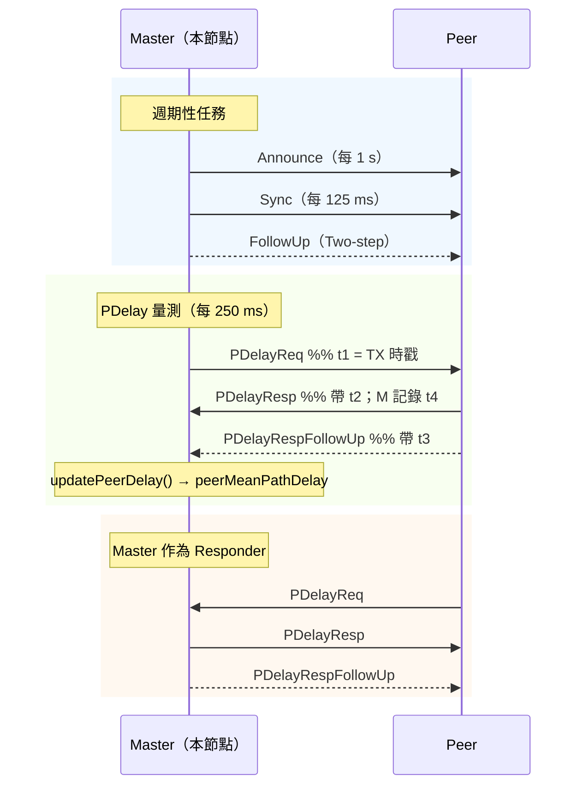
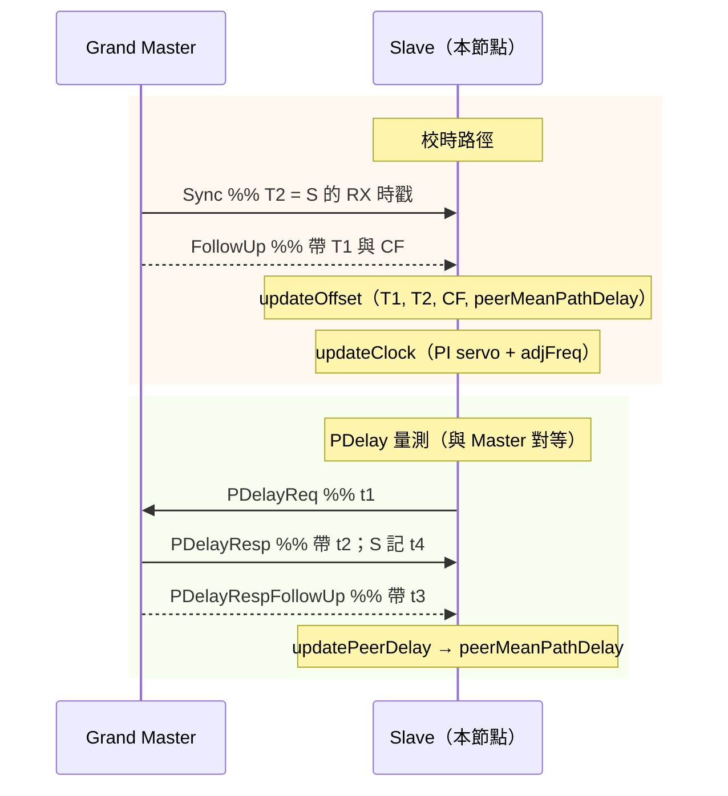
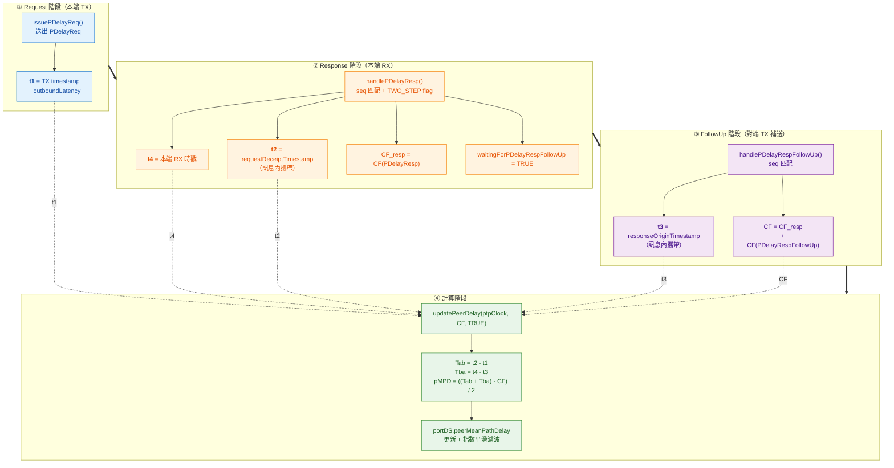
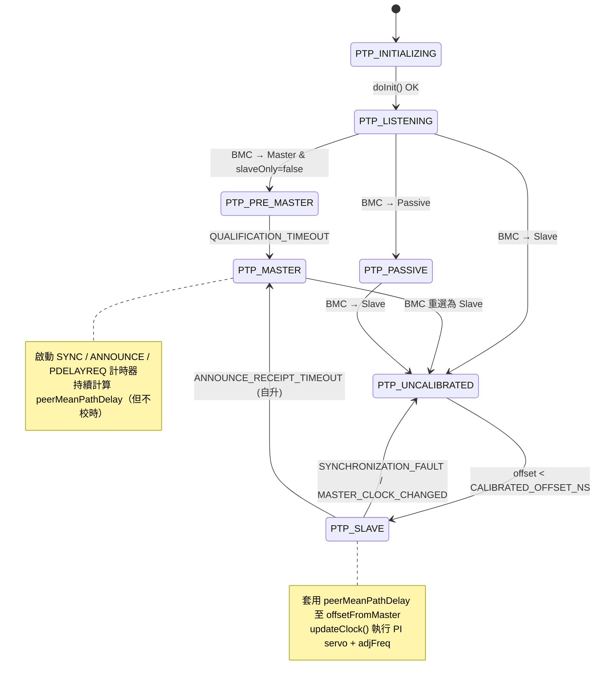

# gPTP (IEEE 802.1AS) 使用說明：Master / Slave 流程與 `peerMeanPathDelay` 運作

> 本文件基於本專案 `middlewares/3rd_party/ptpd-2.0.0/` 的實際原始碼整理，
> 聚焦於 gPTP (`TRANSPORT_IEEE_802_1AS`) 模式下：
> - Master / Slave 兩種角色的**完整處理流程差異**
> - **`peerMeanPathDelay`**（對端平均路徑延遲）**的計算、套用與兩種角色下的用途差異**

---

## 1. 總覽

### 1.1 模式與預設配置

gPTP 模式在編譯期由 `constants.h` 選定；當 `PTP_NETWORK_TRANSPORT == TRANSPORT_IEEE_802_1AS` 時，執行期會自動套用 gPTP profile：

| 項目 | 值 | 來源 |
|------|----|------|
| `transportType` | `TRANSPORT_IEEE_802_1AS` (4) | `constants.h` → `DEFAULT_NETWORK_TRANSPORT` |
| `delayMechanism` | 強制 `P2P` | `ptpd.c` 初始化時覆寫 |
| `twoStepFlag` | `TRUE`（gPTP 永遠 two-step） | `DEFAULT_TWO_STEP_FLAG`（`PTP_NETWORK_TRANSPORT == 4`） |
| `transportSpecific` (`majorSdoId`) | `0x1` | `DEFAULT_TRANSPORT_SPECIFIC_8021AS` |
| `logAnnounceInterval` | `0`（1 s） | `DEFAULT_ANNOUNCE_INTERVAL_8021AS` |
| `logSyncInterval` | `-3`（125 ms） | `DEFAULT_SYNC_INTERVAL_8021AS` |
| `logMinPdelayReqInterval` | `-2`（250 ms） | `DEFAULT_PDELAYREQ_INTERVAL_8021AS` |
| `announceReceiptTimeout` | `3` | `DEFAULT_ANNOUNCE_RECEIPT_TIMEOUT_8021AS` |
| L2 目的 MAC | `01:80:C2:00:00:0E` | `net.c` (`PTP_MAC_IEEE_802_1AS`) |
| EtherType | `0x88F7` | L2 直接封裝 |

```c
/* ptpd.c — PTPd_Init() */
if (rtOpts.transportType == TRANSPORT_IEEE_802_1AS)
{
    rtOpts.delayMechanism          = P2P;
    rtOpts.announceInterval        = DEFAULT_ANNOUNCE_INTERVAL_8021AS;
    rtOpts.syncInterval            = DEFAULT_SYNC_INTERVAL_8021AS;
    rtOpts.clockQuality.offsetScaledLogVariance = DEFAULT_CLOCK_VARIANCE_8021AS;
}
```

### 1.2 角色如何決定

所有節點都跑相同程式碼，角色由 **BMC (Best Master Clock) 演算法**在執行期動態決定：

- 收到 Announce → 觸發 `STATE_DECISION_EVENT` → `bmc()` 重新選舉
- 結果為 `PTP_MASTER` / `PTP_PASSIVE` / `PTP_SLAVE` 之一，透過 `toState()` 遷移
- `SLAVE_ONLY` 被設為 `FALSE`（`constants.h`），因此本節點**允許成為 Master**

```
PTP_INITIALIZING → PTP_LISTENING
    ├─(BMC: 本節點最優)→ PTP_PRE_MASTER → PTP_MASTER
    └─(BMC: 有更優 Master)→ PTP_UNCALIBRATED → PTP_SLAVE
```

### 1.3 訊息分類速查

| 訊息 | Master 發送 | Master 接收 | Slave 發送 | Slave 接收 |
|------|:-----------:|:-----------:|:----------:|:----------:|
| Announce | ✔ | 視情況（BMC 重選） | — | ✔ |
| Sync / FollowUp | ✔ | ✘（忽略來自其他 Master） | — | ✔（校時來源） |
| **PDelayReq** | ✔（量測鏈路延遲） | ✔（回覆 PDelayResp） | ✔（量測鏈路延遲） | ✔（回覆 PDelayResp） |
| **PDelayResp / FollowUp** | ✔（回覆給對端） | ✔（算自己的 `peerMeanPathDelay`） | ✔（回覆給對端） | ✔（算自己的 `peerMeanPathDelay`） |

> gPTP 的 **PDelay 交換是按每條鏈路（per-link）分別量測，與 Master/Slave 角色無關**——兩端都必須持續維護 `peerMeanPathDelay`。

---

## 2. Master 模式流程

### 2.1 進入 Master 狀態：啟動三個計時器

```c
/* protocol.c — toState(PTP_MASTER) */
case PTP_MASTER:
    timerStart(SYNC_INTERVAL_TIMER,     pow2ms(ptpClock->portDS.logSyncInterval),     ptpClock->itimer);
    timerStart(ANNOUNCE_INTERVAL_TIMER, pow2ms(ptpClock->portDS.logAnnounceInterval), ptpClock->itimer);
    switch (ptpClock->portDS.delayMechanism)
    {
    case P2P:
        timerStart(PDELAYREQ_INTERVAL_TIMER,
                   safeGetRand(pow2ms(ptpClock->portDS.logMinPdelayReqInterval) + 1),
                   ptpClock->itimer);                 /* ← Master 也啟動 PDelay 計時器 */
        break;
    }
    ptpClock->portDS.portState = PTP_MASTER;
```

### 2.2 Master 主迴圈的動作

```c
/* protocol.c — doState() 的 PTP_MASTER 分支 */
case PTP_MASTER:
    if (timerExpired(SYNC_INTERVAL_TIMER,     ...)) issueSync(ptpClock);       /* 125 ms */
    if (timerExpired(ANNOUNCE_INTERVAL_TIMER, ...)) issueAnnounce(ptpClock);   /* 1 s */
    handle(ptpClock);                                                          /* 處理收到的訊息 */
    issueDelayReqTimerExpired(ptpClock);                                       /* 檢查 PDelay 計時器 */
```

- `issueSync()` 送出 Sync，若 `twoStepFlag == TRUE`（gPTP 預設）再 `issueFollowup()`。
- `issueAnnounce()` 週期性廣播 Announce，供下游 BMC 使用。
- `issueDelayReqTimerExpired()` 的 P2P 分支**沒有**「非 Slave 就跳過」的保護，Master 同樣會定期發 `PDelayReq`。

### 2.3 Master 對各類訊息的處理

| 收到的訊息 | Master 的動作 |
|-----------|---------------|
| **Announce**（他端） | 放入 `foreignMasterDS`、設 `STATE_DECISION_EVENT`；BMC 可能把自己降為 Slave |
| **Sync / FollowUp**（他端） | `DBGV("from another master")` 後忽略，**不呼叫 `updateOffset()` / `updateClock()`** |
| **PDelayReq**（他端） | 立即回 `PDelayResp`；若 `twoStepFlag == TRUE` 再回 `PDelayRespFollowUp` |
| **PDelayResp**（對 Master 自己發出的 PDelayReq） | 擷取 `t4`（本端 RX）、`t2`（對端 RX），暫存 `correctionField_pDelayResp` |
| **PDelayRespFollowUp** | 擷取 `t3`（對端 TX），合併 CF，呼叫 `updatePeerDelay()` → 更新 `peerMeanPathDelay` |
| **DelayReq / DelayResp** | 在 P2P 模式下 `ERROR("disreguard in P2P mode")` |

### 2.4 時序圖（Master 視角）



---

## 3. Slave 模式流程

### 3.1 進入 Slave 狀態

Slave 的計時器是在 **`PTP_UNCALIBRATED`** 階段就啟動的（BMC 判定要成為 Slave 時，會先轉到 `PTP_UNCALIBRATED`，收斂後才進 `PTP_SLAVE`）：

```c
/* protocol.c — toState(PTP_UNCALIBRATED) */
case PTP_UNCALIBRATED:
    timerStart(ANNOUNCE_RECEIPT_TIMER,
               ptpClock->portDS.announceReceiptTimeout * pow2ms(ptpClock->portDS.logAnnounceInterval),
               ptpClock->itimer);
    switch (ptpClock->portDS.delayMechanism)
    {
    case P2P:
        timerStart(PDELAYREQ_INTERVAL_TIMER,
                   safeGetRand(pow2ms(ptpClock->portDS.logMinPdelayReqInterval + 1)),
                   ptpClock->itimer);                 /* ← Slave 啟動 PDelay 計時器 */
        break;
    }

/* toState(PTP_SLAVE) 本身只切換狀態，計時器延用 UNCALIBRATED 啟動的那組 */
case PTP_SLAVE:
    ptpClock->portDS.portState = PTP_SLAVE;
    break;
```

### 3.2 Slave 主迴圈的動作

```c
/* protocol.c — doState() 的 PTP_LISTENING/UNCALIBRATED/SLAVE/PASSIVE 分支（合併） */
case PTP_LISTENING:
case PTP_UNCALIBRATED:
case PTP_SLAVE:
case PTP_PASSIVE:
    if (timerExpired(ANNOUNCE_RECEIPT_TIMER, ...)) {
        /* 失去 Master → 自行成為 Master 或回到 LISTENING */
        ...
    }
    handle(ptpClock);
    issueDelayReqTimerExpired(ptpClock);    /* P2P 分支會發 PDelayReq */
```

### 3.3 Slave 對各類訊息的處理

| 收到的訊息 | Slave 的動作 |
|-----------|--------------|
| **Announce**（當前 Parent） | `s1()` 更新 `parentDS`、重置 `ANNOUNCE_RECEIPT_TIMER` |
| **Announce**（其他 Master） | 加入 `foreignMasterDS`、觸發 BMC |
| **Sync**（當前 Parent） | 記錄 `timestamp_syncRecieve`；若 two-step → `waitingForFollowUp = TRUE`，否則直接 `updateOffset()` + `updateClock()` |
| **FollowUp**（當前 Parent） | 合併 CF，呼叫 `updateOffset()` + `updateClock()` → **校時** |
| **PDelayReq** | 與 Master 相同：回 `PDelayResp`（+ `PDelayRespFollowUp`） |
| **PDelayResp / FollowUp** | 與 Master 相同：計算 `peerMeanPathDelay` |

### 3.4 Slave 校時路徑（核心）

```c
/* protocol.c — handleFollowUp() 在 PTP_SLAVE / PTP_UNCALIBRATED 分支 */
case PTP_UNCALIBRATED:
case PTP_SLAVE:
    ...
    toInternalTime(&preciseOriginTimestamp,
                   &ptpClock->msgTmp.follow.preciseOriginTimestamp);        /* T1 */
    scaledNanosecondsToInternalTime(&ptpClock->msgTmpHeader.correctionfield, &correctionField);
    addTime(&correctionField, &correctionField, &ptpClock->correctionField_sync);

    updateOffset(ptpClock,
                 &ptpClock->timestamp_syncRecieve,                          /* T2 */
                 &preciseOriginTimestamp,                                   /* T1 */
                 &correctionField);
    updateClock(ptpClock);
    break;
```

其中 `updateOffset()` 在 `P2P` 分支會扣掉 `peerMeanPathDelay`：

```c
/* servo.c — updateOffset() */
case P2P:
    subTime(&ptpClock->currentDS.offsetFromMaster,
            &ptpClock->currentDS.offsetFromMaster,
            &ptpClock->portDS.peerMeanPathDelay);        /* ★ Slave 才真正用到 */
    break;
```

### 3.5 時序圖（Slave 視角）



---

## 4. `peerMeanPathDelay` 完整說明

### 4.1 t1 ~ t4 的意義與來源

以本端為 Requestor 為例（Master 或 Slave 皆適用）：

| 時間戳 | 角色 | 說明 | 來源函式 |
|--------|------|------|----------|
| **t1** | 本端 TX | 本端送出 PDelayReq 的時刻 | `issuePDelayReq()` |
| **t2** | 對端 RX | 對端收到 PDelayReq 的時刻（由 PDelayResp 攜帶回來） | `handlePDelayResp()` |
| **t3** | 對端 TX | 對端送出 PDelayResp 的時刻（由 PDelayRespFollowUp 攜帶） | `handlePDelayRespFollowUp()` |
| **t4** | 本端 RX | 本端收到 PDelayResp 的時刻 | `handlePDelayResp()` |

### 4.2 計算公式

Two-step（gPTP 預設）：

```
Tab = t2 - t1     (PDelayReq 的傳輸時間 + 對端處理延遲)
Tba = t4 - t3     (PDelayResp 的傳輸時間 + 本端處理延遲)

peerMeanPathDelay = ((Tab + Tba) - correctionField) / 2
                    ↑ correctionField = CF(PDelayResp) + CF(PDelayRespFollowUp)
```

One-step（非 gPTP 模式才可能用到）：

```
peerMeanPathDelay = ((t4 - t1) - correctionField) / 2
```

> 差異：one-step 沒有 FollowUp，無法分離對端處理延遲，因此 `correctionField` 必須由對端塞入 PDelayResp 的 CF 欄位。

### 4.3 程式碼實作

```c
/* servo.c — updatePeerDelay() */
void updatePeerDelay(PtpClock *ptpClock, const TimeInternal *correctionField, Boolean twoStep)
{
    if (twoStep) {
        TimeInternal Tab, Tba;
        subTime(&Tab, &ptpClock->pdelay_t2, &ptpClock->pdelay_t1);    /* Tab = t2 - t1 */
        subTime(&Tba, &ptpClock->pdelay_t4, &ptpClock->pdelay_t3);    /* Tba = t4 - t3 */
        addTime(&ptpClock->portDS.peerMeanPathDelay, &Tab, &Tba);     /* Tab + Tba */
    } else {
        subTime(&ptpClock->portDS.peerMeanPathDelay,
                &ptpClock->pdelay_t4, &ptpClock->pdelay_t1);          /* t4 - t1 */
    }
    subTime(&ptpClock->portDS.peerMeanPathDelay,
            &ptpClock->portDS.peerMeanPathDelay, correctionField);    /* 減去合併 CF */
    div2Time(&ptpClock->portDS.peerMeanPathDelay);                    /* 除以 2 */

    if (ptpClock->portDS.peerMeanPathDelay.seconds == 0) {
        filter(&ptpClock->portDS.peerMeanPathDelay.nanoseconds,
               &ptpClock->owd_filt);                                  /* 指數平滑 */
    }
}
```

### 4.4 Two-step 完整處理鏈（以本端為 Requestor）

整條處理鏈可分為 **四個階段**：① 本端發送 → ② 對端回覆 → ③ 對端補送 FollowUp → ④ 本端計算。每個階段負責蒐集一個或多個時戳，最後一次匯入 `updatePeerDelay()`。



> **閱讀提示**
> - 粗箭頭 `==>` 代表事件的時間先後關係（階段順序）。  
> - 虛線 `-.->` 標示各階段產出的**時戳／CF** 最後都會被 `updatePeerDelay()` 消費。  
> - 四種顏色分別對應 Request（藍）、Response（橘）、FollowUp（紫）、計算（綠），方便與 §4.1 的 t1~t4 表對照。

---

## 5. `peerMeanPathDelay` 在 Master / Slave 的用途差異

| 面向 | Master | Slave |
|------|--------|-------|
| 是否計算 | ✔（`handlePDelayResp/FollowUp` 的 `case PTP_MASTER:` 與 `PTP_SLAVE:` 為 fall-through） | ✔ |
| 是否套用至 `offsetFromMaster` | ✘（`updateOffset()` 不會被呼叫） | ✔（`updateOffset()` P2P 分支扣掉它） |
| 是否校時 | ✘（`updateClock()` 不會被呼叫） | ✔（PI servo → `adjFreq`） |
| 主要用途 | (1) 維持 PDelay 狀態機、(2) 診斷資料、(3) 角色切換時即可使用 | 校正 `offsetFromMaster`、顯示一鏈路延遲 |
| 典型顯示 | 不會進入 `updateClock` 的 `printf` | `updateClock: offset from master: ... peer delay: XXX ns` |

### 5.1 Master 端：為何仍要算 `peerMeanPathDelay`？

先說結論：**Master 端在 P2P/gPTP 下會完整執行 PDelay 量測與 `peerMeanPathDelay` 計算，但不會把這個值拿去做 `updateOffset()` / `updateClock()`。**

Master 端計算流程可視為以下 6 步：

1. `toState(PTP_MASTER)` 啟動 `PDELAYREQ_INTERVAL_TIMER`。  
2. `issueDelayReqTimerExpired()` 在 `P2P` 分支逾時時發送 `PDelayReq`（此分支無「僅 Slave」限制）。  
3. `issuePDelayReq()` 送出時取得 `t1`。  
4. `handlePDelayResp()` 收到回覆後擷取 `t2`（訊息內）與 `t4`（本端 RX），並暫存 `CF(PDelayResp)`。  
5. `handlePDelayRespFollowUp()` 擷取 `t3`，合併 `CF(PDelayResp) + CF(PDelayRespFollowUp)`。  
6. 呼叫 `updatePeerDelay()` 計算並更新 `portDS.peerMeanPathDelay`（含濾波）。

Two-step（gPTP 預設）公式如下：

```
Tab = t2 - t1
Tba = t4 - t3
peerMeanPathDelay = ((Tab + Tba) - correctionField) / 2
correctionField   = CF(PDelayResp) + CF(PDelayRespFollowUp)
```

> 重點：Master 與 Slave 在「如何計算」`peerMeanPathDelay` 上是同一路徑；差別只在後續是否進入校時 servo。

1. **PDelay 狀態機一致性**
   `toState(PTP_MASTER)` 仍會啟動 `PDELAYREQ_INTERVAL_TIMER`，且 `issueDelayReqTimerExpired()` 的 P2P 分支不檢查狀態。符合 IEEE 802.1AS 規範——PDelay 是按每條鏈路分別量測，與角色無關。

   ```c
   /* E2E 有狀態檢查：Master 不會跳這裡 */
   case E2E:
       if (ptpClock->portDS.portState != PTP_SLAVE) break;
       ...
   /* P2P 沒有狀態檢查：Master 也會進來 */
   case P2P:
       if (timerExpired(PDELAYREQ_INTERVAL_TIMER, ptpClock->itimer)) {
           timerStart(PDELAYREQ_INTERVAL_TIMER, ...);
           issuePDelayReq(ptpClock);
       }
       break;
   ```

2. **角色切換時立即可用**
   BMC 發現有更好的 Master → 節點由 `PTP_MASTER` → `PTP_UNCALIBRATED` → `PTP_SLAVE`。由於 Master 期間持續量測 PDelay，**切換瞬間即具備有效的 `peerMeanPathDelay`**，不必等 250 ms×N 累積才能開始校時。

3. **診斷 / 統計**
   Master 端若要觀察 `peerMeanPathDelay`，需自行在 `updatePeerDelay()` 加 log（`updateClock()` 的預設 `printf` 在 Master 下不會觸發）。

### 5.1.1 Master 與 Slave 在 `peerMeanPathDelay` 的差異（快速版）

| 面向 | Master | Slave |
|------|--------|-------|
| 發 `PDelayReq`、收 `PDelayResp/FollowUp` | ✔ | ✔ |
| 執行 `updatePeerDelay()` 計算 | ✔ | ✔ |
| 在 `updateOffset()` 扣除 `peerMeanPathDelay` | ✘ | ✔ |
| 呼叫 `updateClock()` 做 PI 校時 | ✘ | ✔ |
| 主要用途 | 狀態機維持、切換待命、診斷 | 實際校時補償 |

### 5.2 Slave 端：`peerMeanPathDelay` 的真正用途

Slave 收到 Sync → 等 FollowUp → 呼叫 `updateOffset()`：

```c
/* servo.c — updateOffset()（節錄） */
subTime(&ptpClock->Tms, syncEventIngressTimestamp, preciseOriginTimestamp);  /* T2 - T1 */
subTime(&ptpClock->Tms, &ptpClock->Tms, correctionField);                    /* 減去 CF */
ptpClock->currentDS.offsetFromMaster = ptpClock->Tms;

switch (ptpClock->portDS.delayMechanism) {
case P2P:
    subTime(&ptpClock->currentDS.offsetFromMaster,
            &ptpClock->currentDS.offsetFromMaster,
            &ptpClock->portDS.peerMeanPathDelay);     /* ★ 關鍵：扣掉 peer delay */
    break;
}
```

亦即：

```
offsetFromMaster = (T2 - T1 - CF) - peerMeanPathDelay
```

接著 `updateClock()` 套用 PI servo → `adjFreq()`，完成校時。

### 5.3 為何 Master 不會校時？——程式路徑對照

```c
/* protocol.c — handleSync() / handleFollowUp() 的狀態分支 */
case PTP_UNCALIBRATED:
case PTP_SLAVE:
    ...
    updateOffset(ptpClock, ...);
    updateClock(ptpClock);                /* ← 只在這兩個狀態會被呼叫 */
    break;

case PTP_MASTER:
    DBGV("from another master");
    break;                                /* ← Master 直接跳過 */
```

因此：**`updateOffset()` 和 `updateClock()` 只會在 Slave / Uncalibrated 被呼叫**，Master 計算出的 `peerMeanPathDelay` 只會靜靜躺在 `portDS` 裡待命。

---

## 6. 狀態遷移總圖



---

## 7. 常見問題

### Q1：為什麼我在 Master 模式下看不到 `updateClock: ... peer delay: XXX ns` 的輸出？
A：`updateClock()` 只在 `handleSync() / handleFollowUp()` 的 `PTP_SLAVE` / `PTP_UNCALIBRATED` 分支被呼叫。Master 想觀察 `peerMeanPathDelay` 需自行在 `updatePeerDelay()` 加 log。

### Q2：Master 真的會持續發 `PDelayReq` 嗎？看起來只有 Slave 該發。
A：是的。gPTP 規範中 PDelay 是按每條鏈路分別量測，與角色無關。`toState(PTP_MASTER)` 會啟動 `PDELAYREQ_INTERVAL_TIMER`，`issueDelayReqTimerExpired()` 的 P2P 分支沒有狀態限制，Master 確實會週期性發送。

### Q3：Master → Slave 切換會遺失 `peerMeanPathDelay` 嗎？
A：不會。`initClock()` 只會在 `updateClock()` 對大偏移 reset 時觸發，角色切換本身不清除 `portDS.peerMeanPathDelay`。切換後 Slave 立即可用累積的延遲值校時。

### Q4：二級（two-step）Follow-up 延遲到來前可否先算？
A：不行。`handlePDelayResp()` 只會在收到 FollowUp（two-step 下）才呼叫 `updatePeerDelay()`；one-step 模式才會在 PDelayResp 階段直接計算。gPTP 預設是 two-step。

### Q5：如何調 `PDelayReq` 頻率？
A：修改 `constants.h` 中的 `DEFAULT_PDELAYREQ_INTERVAL_8021AS`（log2 秒），或以編譯期 `-D` 覆寫。預設 `-2` = 250 ms。

---

## 8. 關鍵程式碼索引

| 項目 | 檔案 : 函式 |
|------|-------------|
| 傳輸模式選擇 / gPTP 預設值 | `middlewares/3rd_party/ptpd-2.0.0/src/constants.h` |
| 802.1AS 強制 P2P + 套用 profile | `middlewares/3rd_party/ptpd-2.0.0/src/ptpd.c : PTPd_Init()` |
| BMC 套用 gPTP timeout / interval | `middlewares/3rd_party/ptpd-2.0.0/src/bmc.c : initData()` |
| 狀態遷移 / 計時器啟動 | `protocol.c : toState()` |
| 主迴圈（每狀態動作） | `protocol.c : doState()` |
| 訊息分派 | `protocol.c : handle()` |
| t1 擷取（Requestor 發送） | `protocol.c : issuePDelayReq()` |
| t2 / t4 擷取 | `protocol.c : handlePDelayResp()` |
| t3 擷取 | `protocol.c : handlePDelayRespFollowUp()` |
| Responder 流程 | `protocol.c : handlePDelayReq()` → `issuePDelayResp()` (+ `issuePDelayRespFollowUp()`) |
| `peerMeanPathDelay` 計算 | `dep/servo.c : updatePeerDelay()` |
| Slave 校時（套用 peer delay） | `dep/servo.c : updateOffset()` / `updateClock()` |
| L2 目的 MAC 選擇 | `dep/net.c` |
| PDelay 計時器發射 | `protocol.c : issueDelayReqTimerExpired()` |

---

## 9. 相關文件

- `doc/CURRENT_PTP_CONFIG.md` — 當前編譯期設定、驗證清單、效能指標
- `doc/PTP_TRANSPORT_IMPLEMENTATION_SPEC.md` — 傳輸層實作規範
- IEEE 802.1AS-2020 — gPTP 規範本體
- IEEE 1588-2008 — PTPv2 規範（gPTP 繼承自此）
